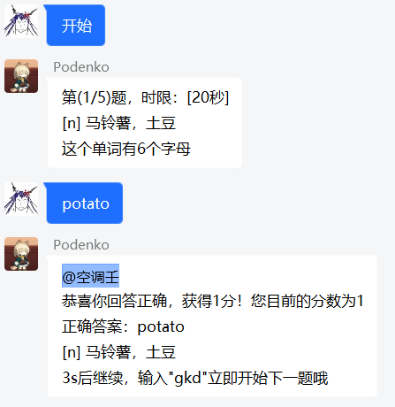

# 单词竞赛插件

> 基于 Mirai Console 的英语单词竞赛插件

### 必备环境

1. 该插件目前还不需要chat-command插件，但日后的更新可能会使用

### 使用方法

1. 从 [该项目的release](https://github.com/DRSalieri/miraitest/releases)中，下载最新版jar形式插件
2. 将该jar文件放入 Mirai Console 的 Plugins 文件夹中
3. 从 [该项目的release](https://github.com/DRSalieri/miraitest/releases)中，下载 Books.zip 文件，将其解压到 mcl的目录下 ....data/english-helper/BooksData/Books（如果没有文件夹可以自行创建）

### 功能

| 指令                      | 功能                                                         |
| ------------------------- | ------------------------------------------------------------ |
| 背单词 \<book\> \<times\> | 设定本群的单词竞赛信息，book为书名，times为次数，设定完毕后通过"开始"启动 |
| 开始                      | 启动已经设置好的单词竞赛                                     |

每个单词的时间限制为20s
第5s若无人答出，给出第一个提示（提示首字母）
第10s若无人答出，给出第二个提示（提示前三个字母）
任何人都可以答题

答对者加一分，最后降序输出所有获得过分数的群成员

### 使用截图

### Todo

- [ ] 添加全局数据

### 数据来源

Books  https://github.com/kajweb/dict
